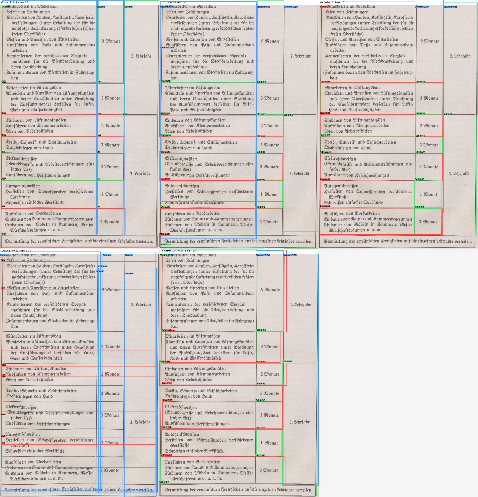

# Table Recognition in Document Images

Master's thesis project on **table structure recognition in historical document images**, developed at the University of Koblenz.

The project evaluates and adapts multiple computer-vision architectures for recovering table structures from scanned historical regulatory documents. These documents contain challenges such as scan artifacts, inconsistent typography, irregular table borders, merged cells, and heterogeneous layouts.

## Project Overview

The experimental workflow includes:

- manual annotation and dataset preparation
- table-region cropping and coordinate conversion
- model-specific class-schema conversion
- fine-tuning of multiple detection and transformer-based models
- quantitative evaluation
- IoU-based annotation-quality analysis
- qualitative error analysis
- visualization of model predictions
- logical table-structure reconstruction as a proof of concept

## Models Evaluated

| Model | Approach | Evaluated Schema |
|---|---|---|
| **YOLOv8** | One-stage object detector | 5 classes |
| **YOLOv10** | NMS-free one-stage object detector | 5 classes |
| **Nemotron / YOLOX** | YOLOX-based table-structure detector | 3 classes |
| **Table Transformer (TATR)** | DETR-based transformer model | 4 supported classes |

### Five-class schema

Used for YOLOv8 and YOLOv10:

- Row
- Column
- Cell
- Header-Row
- Spanning-Cell

### Nemotron three-class schema

- Cell
- Row
- Column

Header-Row annotations are merged into Row and Spanning-Cell annotations are merged into Cell for this setup.

### TATR-compatible schema

- Row
- Column
- Header-Row
- Spanning-Cell

TATR does not directly predict individual Cell objects in the evaluated configuration.

## Dataset

The final annotated dataset contains:

| Item | Count |
|---|---:|
| Annotated document pages | 100 |
| Cropped table instances | 112 |
| Training table crops | 86 |
| Validation table crops | 26 |
| Total structure annotations | 2,583 |

Five-class annotation distribution:

| Class | Instances |
|---|---:|
| Cell | 1,558 |
| Row | 603 |
| Column | 343 |
| Header-Row | 59 |
| Spanning-Cell | 20 |

The dataset was constructed from historical BIBB vocational-education and training regulation documents.

## Selected Results

### YOLO-based five-class models

| Model | Precision | Recall | mAP50 | mAP50-95 |
|---|---:|---:|---:|---:|
| **YOLOv8** | 0.821 | 0.588 | **0.717** | **0.501** |
| **YOLOv10** | **0.863** | 0.493 | 0.581 | 0.417 |

YOLOv8 achieved the strongest overall performance on the full five-class task, while YOLOv10 achieved higher precision.

### Nemotron / YOLOX three-class evaluation

| Metric | Result |
|---|---:|
| AP50-95 | 0.718 |
| AP50 | 0.911 |
| AP75 | 0.809 |
| AR50-95 | 0.791 |

Nemotron showed strong performance on the reduced three-class core structure task.

### Table Transformer

For TATR's supported structure classes, the best evaluated operating point achieved:

| Metric | Result |
|---|---:|
| Precision | 0.664 |
| Recall | 0.440 |
| F1 | 0.529 |

Because the evaluated models use different class schemas, metrics across all four models should not be interpreted as a direct one-to-one ranking.

## Qualitative Comparison

The following example compares ground truth with predictions from the evaluated models on a historical table instance.

Additional qualitative examples are available in the `figures/` directory.

## Repository Structure

- `scripts/dataset_preparation/` — dataset conversion and preparation
- `scripts/training/` — Nemotron and Table Transformer fine-tuning
- `scripts/evaluation/` — evaluation and IoU analysis
- `scripts/prediction_export/` — inference and prediction conversion
- `scripts/visualization/` — qualitative overlays and comparison figures
- `configs/` — class mappings and dataset configurations
- `results/` — metrics, logs, summaries, and logical-structure proof of concept
- `figures/` — selected qualitative results
- `evidence/` — final experiment evidence package
- `data/` — dataset documentation
- `models/` — checkpoint documentation
- `appendix/` — additional reproducibility notes

## Experiment Evidence

The `evidence/` directory preserves selected thesis experiment artifacts, including:

- final result summaries
- IoU analysis
- training evidence
- evaluation logs
- qualitative examples
- YOLO validation outputs
- TATR evaluation sources
- Nemotron evaluation sources

Large raw datasets and model checkpoints are intentionally excluded.

## Logical Structure Proof of Concept

A post-processing proof of concept is included under `results/logical_structure_poc/`.

It demonstrates how detected structural components can be converted into a logical table representation after object detection.

This component is exploratory and is not treated as a separately benchmarked model in the thesis evaluation.

## Technologies

- Python
- PyTorch
- Ultralytics YOLO
- YOLOX
- Hugging Face Transformers
- Table Transformer
- OpenCV
- NumPy
- Pandas
- Label Studio
- COCO-style annotations
- YAML and JSON dataset configurations
- Linux and GPU-based model training

## Reproducibility

Environment and dependency information is provided through:

- `requirements.txt`
- `environment.yml`
- `REPRODUCIBILITY.md`
- `configs/`

Dataset paths, complete raw datasets, and large model checkpoints are intentionally not included in the repository.

## Scope

This project focuses on **table structure recognition** rather than OCR or semantic extraction of table contents.

The main objective is to identify structural regions such as rows, columns, cells, header rows, and spanning cells in challenging historical document images.

## Thesis Context

**Title:** Table Recognition in Document Images  
**Degree:** M.Sc. Web and Data Science  
**University:** University of Koblenz

This repository contains the implementation, experiment configurations, evaluation artifacts, and selected evidence produced during the master's thesis.
